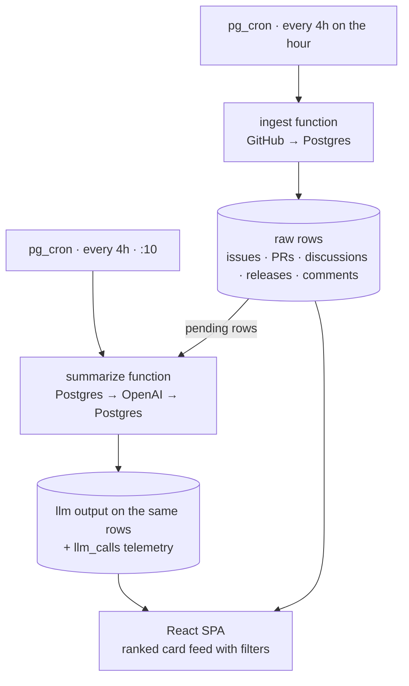

# Architecture

A continuously-updated, AI-summarised view of activity in the
[`neo-project`](https://github.com/orgs/neo-project/repositories) GitHub
organisation. A bot scans the org every few hours; an LLM turns the raw
firehose — issues, pull requests, discussions, releases, commits — into short
summaries with the **consensus** of each conversation, sentiment, key
points, decisions, and a marker whenever a Neo founder participated. A
static React SPA reads the result via PostgREST and renders it as a
ranked, filterable feed.

The audience is the **broad Neo community** — people who follow the
project but don't normally browse GitHub. The AI summaries are the
product; everything else (layout, filters, chrome) exists to make them
findable.

---

## 1. Tech stack

| Concern | Choice | Why |
|---|---|---|
| Database | Supabase Postgres | Single home for raw GitHub data + LLM output + cron |
| Scheduling | `pg_cron` + `pg_net` | Native to Supabase; calls Edge Functions on a schedule. Ingest fires every 4 hours; summarize fires 10 minutes later. |
| Compute | Supabase Edge Functions (Deno/TS) | Two functions: `ingest` (GitHub → Postgres) and `summarize` (Postgres → OpenAI → Postgres) |
| GitHub API | REST v3 + GraphQL v4 | Discussions are GraphQL-only; everything else is REST |
| LLM | OpenAI — `gpt-4o-mini` for per-item summaries and releases, `gpt-4o` for the optional org-level digest | Mini is ~16× cheaper than 4o and plenty for "summarise this thread"; 4o reserved for any manual `org_digest` synthesis |
| Frontend | Vite + React + TypeScript + React Router + TanStack Query, shipped as a static SPA at `apps/web/` | No SSR needed. Client reads Supabase directly via PostgREST under RLS using the anon key. No shadcn — the UI is custom (Reddit-style card feed). |

### Pipeline shape



**Why two functions?** Ingest must be boring and reliable: it touches the
GitHub API under a rate limit, and a half-failed run shouldn't burn LLM
tokens. Summarize is the flaky, slow, costly part: OpenAI rate limits,
occasional errors, variable latency. Modelling it as "drain a queue of
`summary_status='pending'` rows, mark `done`/`error`, retry with backoff"
keeps the whole pipeline robust.

### Wiring the cron in production

Both pg_cron jobs invoke their Edge Functions via `pg_net.http_post`. The
URL prefix and service-role key live in a small private table
`gasetta.config` (no RLS, no `GRANT`):

```sql
insert into gasetta.config (key, value) values
  ('functions_base_url', 'https://YOUR_PROJECT.supabase.co/functions/v1'),
  ('service_role_key',   '<service-role key>')
on conflict (key) do update set value = excluded.value;
```

For local development the base URL is `http://kong:8000/functions/v1`. For
tighter production security swap the table to `vault.decrypted_secrets`.

---

## 2. Data model

Raw GitHub data in its own tables; LLM-derived fields live **on the same
rows** (simpler joins for the UI). A separate `llm_calls` table is the
audit log of every OpenAI call with token counts and cost.

```sql
-- ── tracking ───────────────────────────────────────────────
repos(
  id, github_id, name, full_name, description, html_url,
  is_archived, is_fork, stargazers_count, default_branch,
  pushed_at, last_activity_at, created_at, updated_at
)

runs(
  id, started_at, finished_at, status,            -- running | ok | error
  window_start, window_end,                       -- "since last run" window
  repos_seen, items_ingested, items_summarized, error_text
)

sync_state(
  key primary key,        -- e.g. 'org_repos'
  last_run_at,            -- watermark used as GitHub `since` next run
  etag,                   -- conditional requests where supported
  cursor                  -- GraphQL pagination resume
)

contributors(             -- identity map; drives the founder marker
  id, github_login, github_id, display_name,
  aliases text[], role,   -- 'founder' | 'core' | 'community'
  is_founder bool
)
-- seeded: erikzhang, dahongfei

-- ── raw GitHub content ─────────────────────────────────────
commits(id, repo_id, sha, message, author_login, ...)

releases(id, repo_id, tag_name, name, body, is_prerelease, published_at, ...,
         -- llm:
         summary, summary_status, summary_attempts, summarized_at, model)

issues(id, repo_id, number, node_id, title, body, state, ..., comments_count,
       founder_involved,
       -- llm:
       summary, consensus, consensus_chip, sentiment, key_points jsonb,
       decisions jsonb, founder_quotes jsonb,
       summary_status, summary_attempts, summary_error, summarized_at, model,
       last_summarized_comment_count, last_summarized_state)

issue_comments(id, issue_id, node_id, author_login, body, ...,
               is_founder, role)

pull_requests(id, repo_id, number, ..., is_merged, base_ref, additions, deletions, ...,
              founder_involved,
              -- llm fields same as issues, plus:
              last_summarized_is_merged)

pr_reviews(id, pr_id, author_login, state, body, submitted_at, is_founder, role)
pr_comments(id, pr_id, ..., is_founder, role)

discussions(id, repo_id, number, node_id, title, body, category, is_answered, ...,
            founder_involved,
            -- llm fields same as issues, plus:
            last_summarized_is_answered)

discussion_comments(id, discussion_id, parent_id, ..., is_answer, is_founder, role)

-- ── roll-ups & ops ─────────────────────────────────────────
org_digests(id, run_id, edition_date, headline, standfirst, body_md,
            counts jsonb, top_items jsonb, releases jsonb,
            founder_activity jsonb, model, created_at)

llm_calls(id, run_id, purpose, model, subject_type, subject_id,
          tokens_in, tokens_out, cost_usd, latency_ms, status, error_text,
          created_at)
```

**Dedup invariants** — `node_id` is unique everywhere. `(repo_id, number)`
is unique on issues / PRs / discussions; `(repo_id, sha)` on commits;
`(repo_id, tag_name)` on releases. Re-ingesting is idempotent — every
write is an upsert keyed on `node_id`.

**`run_id` on raw rows** records which run last touched the row.
Combined with the snapshot columns (`last_summarized_*`), the summarizer
knows whether the thread has materially changed since the last LLM pass.

Migrations are in `supabase/migrations/`:

- `0001_schema.sql` — tables, indexes, triggers
- `0002_rls.sql` — row-level security, table-level grants
- `0003_summary_gate.sql` — material-change snapshot columns
- `0004_cron.sql` — pg_cron schedules + `gasetta.config`

---

## 3. Ingest function (`supabase/functions/ingest/`)

Trigger: `pg_cron` every 4 hours → `pg_net.http_post` to the function.
First run on a fresh database has no watermark; it bootstraps to a
configurable window (default 30 days) controlled by
`GASETTA_BOOTSTRAP_DAYS`.

Steps:

1. **Reap stale runs** — close any `running` run older than 30 minutes
   with `status='error'` (an earlier function timed out, was killed, or
   crashed). Without this the table fills with phantom in-flight rows.
2. **Open a runs row** — `status='running'`,
   `window_start = sync_state.last_run_at`, `window_end = now()`.
3. **Load contributors** into an in-memory `Map<login, role>` for
   founder/core marker lookup.
4. **List org repos** — `GET /orgs/neo-project/repos?per_page=100`,
   paginate, upsert into `repos`. Skip `archived` and `fork`.
5. **Per repo, in a bounded worker pool** (default 5 repos in flight):
   - `GET /repos/:owner/:repo/commits?since={window_start}` → upsert commits
   - `GET /repos/:owner/:repo/releases` → filter to those published in
     window, upsert releases
   - `GET /repos/:owner/:repo/issues?since={window_start}&state=all` →
     split into `issues` vs `pull_requests` based on the `pull_request`
     key; for each item fetch its comments, and for PRs also fetch
     reviews + review-comments
   - **Discussions via GraphQL** — `repository(owner,name){ discussions(... orderBy: UPDATED_AT desc) }`, stop paginating once `updatedAt < window_start`. Each query pulls 50 top-level comments and 50 replies per comment in one round trip.
6. **Founder / role detection at write time** — for every author login
   encountered, look up `contributors`; if matched, set
   `is_founder`/`role` on the comment/review row and bubble
   `founder_involved=true` to the parent issue/PR/discussion. **A marker,
   not a filter** — non-founders are ingested normally.
7. **After upsert, run `markPendingIfMaterial*`** — see §4.1. Pure data
   upsert is decoupled from summary scheduling.
8. **Update `sync_state` watermark; close the runs row** with
   `status='ok'`.
9. On any unhandled error, the run is closed with `status='error'` and
   the watermark is **not advanced** — next run retries the same window.

**Rate-limit hygiene** — authenticated REST is 5000 req/h, GraphQL 5000
pts/h. ~40 repos × a handful of calls each = low hundreds per run. The
client respects `Retry-After` on 403/429 and proactively sleeps when
`X-RateLimit-Remaining` drops below 50. Bounded parallelism (5 repos at a
time) means the rate-limit sleep coordinates naturally — all workers see
the same low headroom and back off together.

**Concurrency rule** — parallel at the **repo level**, sequential within
a repo. A hot PR with 200 comments would otherwise hammer one endpoint.

**Token scopes** — fine-grained PAT (read-only):
`metadata:read` + `contents:read` + `pull requests:read` +
`issues:read` + `discussions:read`. No write scopes.

---

## 4. Summarize function (`supabase/functions/summarize/`)

Trigger: `pg_cron` every 4 hours, 10 minutes after ingest. Cheap no-op
when nothing is pending.

Per invocation:

1. **Drain pending items** — `SELECT ... WHERE summary_status='pending' AND summary_attempts < 5` across `issues` / `pull_requests` / `discussions`, capped to `SUMMARIZE_ITEM_LIMIT` (default 50) per table.
2. **Bounded parallel worker pool** (default `SUMMARIZE_CONCURRENCY=5`) sends each item to `gpt-4o-mini` with a strict JSON response format. Each prompt includes the title, body (truncated), and the comment thread (oldest→newest, founder comments kept full).
3. **Write fields back**: `summary`, `consensus`, `consensus_chip`,
   `sentiment`, `key_points`, `decisions`, `founder_quotes`,
   `summary_status='done'`, `summarized_at`, plus the
   `last_summarized_*` snapshot columns. Log the call to `llm_calls`. On
   error: `summary_attempts++`, row stays `pending`; after 5 attempts the
   row is marked `summary_status='error'` with the last error message
   captured in `summary_error`.
4. **Releases** get a one-paragraph "what shipped" summary on mini.
5. **Org digest** — opt-in. The function checks `?digest=true` on the
   URL or `SUMMARIZE_ORG_DIGEST=true` in env. The default (cron-driven)
   path skips this entirely. When requested, the function synthesises an
   `org_digest` row with `gpt-4o` using all currently-summarised items
   plus releases and founder activity as context. Useful for ad-hoc
   weekly recaps; not the primary surface.

### 4.1 The material-change gate

Pure data upsert (in `ingest`) doesn't flip a row to `pending`. A separate
helper (`markPendingIfMaterialIssue` / `…PullRequest` / `…Discussion`,
in `_shared/db.ts`) decides whether the row warrants a re-summary based
on snapshot columns recorded by the previous summary pass:

A row gets `summary_status='pending'` when **any** of these are true
since the last successful summary:

- it has never been summarised (`summarized_at IS NULL`)
- comment count grew by **≥ 3** (`MATERIAL_COMMENT_DELTA`)
- state shifted (open ↔ closed)
- a PR's `is_merged` flipped, or a discussion was marked `is_answered`
- it's been ≥ 7 days since the last summary
  (`MATERIAL_STALE_DAYS` — safety net)

Without this, a single new comment on a stable 50-comment thread would
re-summarise the whole thing on every tick — costly, and visually noisy
as the consensus chip flickers from sampling noise.

### Cost

For a busy week (~150 issues/PRs/discussions touched, avg ~2.5k input /
350 output tokens each on mini), with the optional org digest skipped:

- mini items: 150 × ($0.15 × 2500/1M + $0.60 × 350/1M) ≈ **$0.09/week**
- One optional `org_digest` on 4o: ≈ **$0.09/call**

Pricing is approximate — verify against the current OpenAI rate card.
Either way, the per-month bill is lunch money.

---

## 5. Founder marker

- The product never filters by who. Every contributor's activity is
  ingested and shown. The founder/core marker is purely an annotation.
- `contributors` is the source of truth. Founders are seeded; extend
  later via `seed.sql`.
- Match on `author_login` for everything except commits (where author
  email / name is fuzzier and uses the `aliases[]` array).
- A match sets `is_founder`/`role` on the comment or review row and
  bubbles `founder_involved=true` to the parent thread. The UI surfaces
  this as a highlighter-yellow chip on the card and a pulled-out quote
  block on the thread page.
- The `/founders` page is a filter over the same data, not a separate
  feed.

---

## 6. Frontend (`apps/web/`)

A Vite + React + TypeScript static SPA. Reads Supabase via PostgREST with
the **anon key** under RLS that allows `SELECT` only on the public-read
subset. No secrets in the browser. TanStack Query handles caching and
revalidation.

### App shell

A 3-column layout: filter rail on the left, ranked card feed in the
centre, "about + live stats + top contributors" sidebar on the right.
The TopBar carries the wordmark, route nav, and a "Updated Xm ago" live
indicator with a pulsing dot.

### Pages

- `/` — main feed. Reddit-style cards, ranked by an importance score
  combining recency-decayed comment volume + founder participation +
  contentious-sentiment boost + open-state boost + issue bias + consensus-chip
  bonus. Filters for content type, version (N3/N4), repo. Sort by
  Hot / New / Most discussed. URL state is shareable.
- `/threads/:id` — full consensus block, key points, decisions, founder
  pull-quote.
- `/repos` — repo grid with sparklines and momentum chips.
- `/repos/:name` — repo header + filtered feed.
- `/founders` — founder activity feed with tab strip per founder.
- `/versions` — N3 vs N4 deep view: activity split, breakdown, big-feature
  list.
- `/archive` — historical record of resolved threads (merged, decided,
  resolved, closed).
- `/about` — static text.

### Card design

Every card carries the **consensus chip + one-line AI summary inline**.
That's the differentiator: the synthesis is pulled up to the list level
so a reader scans 12 threads in 30 seconds without clicking through.
Variants: default, founder-touched (highlighter stripe + chip),
contentious, resolved (desaturated), pending-summary, release,
commit-rollup.

### Version classifier (N3 / N4)

There's no `version` column on the schema; it's inferred at read time
from three signals on each thread:

1. **PR branch** — `base_ref` containing `n4` → N4.
2. **Labels** — any label whose name contains `n4` / `neo 4` → N4.
3. **Title** — word-boundary `N4` / `Neo 4` → N4.

Default falls through to **N3** (mainnet maintenance). This matches the
editorial line: when a change applies to both protocols, count it as N3.

For multi-chain expansion this becomes a per-chain classifier; the
front-end's filter UI is already generic.

---

## 7. Security & secrets

- `GITHUB_TOKEN` and `OPENAI_API_KEY` → Supabase Edge Function secrets
  only. Never shipped to the client.
- Frontend gets `VITE_SUPABASE_URL` and `VITE_SUPABASE_ANON_KEY` — both
  public by design; safety is RLS.
- **RLS posture**: RLS enabled on every table. SELECT policy on the 14
  public-read tables for `anon` and `authenticated`. `sync_state` and
  `llm_calls` have no policy and no `GRANT` — fully private. The
  service-role key (used by Edge Functions) bypasses RLS.
- Defense in depth: tables also have explicit `REVOKE ALL` followed by
  `GRANT SELECT` only on the public-read subset, so writes are blocked
  at the privilege layer even if RLS were accidentally disabled.
- `ALTER DEFAULT PRIVILEGES` ensures any new table added to `public`
  starts denied to anon/authenticated — read access is opt-in per-table.
- `pg_cron` jobs read the service-role key from `gasetta.config` (or
  Vault in tighter setups).

---

## 8. Repo layout

```
gasetta/
├─ ARCHITECTURE.md          ← this file
├─ README.md                ← setup + deploy steps
├─ LICENSE
├─ supabase/
│  ├─ config.toml
│  ├─ seed.sql              ← contributors (founders)
│  ├─ migrations/
│  │  ├─ 0001_schema.sql
│  │  ├─ 0002_rls.sql
│  │  ├─ 0003_summary_gate.sql
│  │  └─ 0004_cron.sql
│  └─ functions/
│     ├─ deno.json
│     ├─ _shared/
│     │  ├─ types.ts        ← GitHub API response shapes
│     │  ├─ github.ts       ← REST + GraphQL client
│     │  ├─ openai.ts       ← chat-completions wrapper
│     │  ├─ db.ts           ← service-role client + upsert helpers
│     │  ├─ founders.ts     ← contributor lookup
│     │  ├─ prompts.ts      ← prompt templates
│     │  └─ concurrency.ts  ← bounded worker pool
│     ├─ ingest/index.ts
│     └─ summarize/index.ts
└─ apps/
   └─ web/
      ├─ index.html
      ├─ package.json
      ├─ vite.config.ts
      └─ src/
         ├─ main.tsx
         ├─ router.tsx
         ├─ index.css         ← design tokens + component CSS
         ├─ lib/
         │  ├─ supabase.ts    ← anon client
         │  ├─ v3Loader.ts    ← PostgREST queries + transforms
         │  └─ v3Context.tsx  ← React Query provider
         ├─ data/v3types.ts
         ├─ components/       ← TopBar, LeftRail, RightRail, FeedCard, atoms
         └─ pages/            ← Feed, Thread, Repos, Repo, Founders, Versions, Archive, About
```
