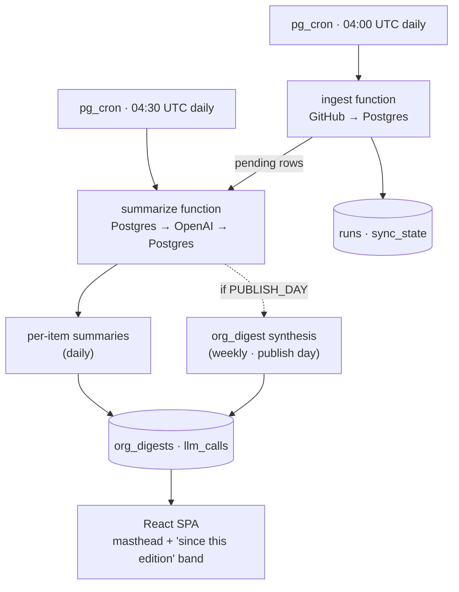

# Gasetta — Neo ecosystem digest

> A periodic, browseable digest of everything happening across the
> [`neo-project`](https://github.com/orgs/neo-project/repositories) GitHub org:
> what changed, what shipped, what people are arguing about, where the consensus
> landed — and a marker whenever one of the two Neo founders shows up in a thread.

**The name** — *Gasetta* = **GAS** token + *gazzetta* (Italian for gazette/newspaper).
So the product literally is a newspaper for the Neo ecosystem: each **repository is a
section** (the consensus repo is "Politics," `neo-modules` is "Tech," release repos are
"Markets," etc. — loosely), each run is an **edition**, and the org-level digest is the
**front page**.

This is the system / data design doc. The UI design brief lives in `design.md`
(handed off to claude-design; the prototype it returned is implemented in
`apps/web/`).

---

## 1. What it does

Every **edition** (default: once a day), the system:

1. Lists all non-archived, non-fork repos in the `neo-project` org.
2. Pulls **everything** that changed **since the last successful run** — *all* activity,
   not just founders': commits, releases, issues (+ comments), pull requests
   (+ reviews/comments), GitHub Discussions (+ comments).
3. Stores the raw records.
4. A separate worker then runs LLM summarization over the new items:
   - per-item summary
   - **consensus** of the discussion so far (where did the thread land? open? split? resolved?)
   - sentiment (positive / mixed / contentious)
   - key points / decisions
   - a **founder-involved** marker + the founder's actual quotes pulled out (this is a
     *flag layered on top of everything*, never a filter — we keep all activity)
5. Rolls those up into a **per-repo digest** (section page) and an **org-level "front
   page" digest**.
6. A static web UI lets users browse all of it without ever opening GitHub.

The point: a Neo follower opens the site, reads the front page, and knows what happened
across ~40 repos and dozens of threads — including whether Erik Zhang or Da Hongfei
weighed in and what they said — without scrolling through GitHub.

---

## 2. Tech stack

| Concern | Choice | Why |
|---|---|---|
| DB | Supabase Postgres | Single home for raw data + LLM output + cron |
| Scheduling | `pg_cron` + `pg_net` | Native to Supabase; calls Edge Functions on a schedule. **Daily refresh, weekly publish**: `ingest` at 04:00 UTC daily, `summarize` at 04:30 UTC daily (drains pending per-item summaries); the editorial `org_digest` synthesis fires only on the configured `GASETTA_PUBLISH_DAY` (default Monday). The front page shows the most recent digest plus a "Since this edition" band of live counts. |
| Compute | Supabase Edge Functions (Deno/TS) | Two functions: `ingest` and `summarize` |
| Data source | GitHub REST v3 + GraphQL v4 | Discussions are GraphQL-only; rest is REST |
| LLM | OpenAI — `gpt-4o-mini` for bulk item summaries, `gpt-4o` for the org front-page digest | mini is ~16× cheaper than 4o and plenty for "summarize this thread"; 4o only for the one synthesis pass that users actually read first |
| Frontend | **Vite + React + TypeScript + Tailwind + React Router**, shipped as a static SPA at `apps/web/` | No SSR needed — skipped Next.js. **No shadcn/ui**: the design is custom editorial (Source Serif 4 prose, warm paper surfaces, highlighter-pen founder marker) that doesn't fit shadcn's neutral defaults — we'd restyle everything anyway. Client reads Supabase directly via PostgREST under RLS. TanStack Query gets added when we wire to live data. If SEO/link-previews ever matter, migrate to Astro later. |
| Hosting (web) | Vercel / Netlify / Cloudflare Pages (any static host) | TBD with you |

### Why split ingest and summarize?

- **Ingest must be boring and reliable** — it touches the GitHub API under a rate
  limit and a time window; if it half-fails we want to retry cleanly without
  re-spending LLM tokens.
- **Summarize is the flaky, slow, costly part** — OpenAI rate limits, occasional
  errors, variable latency. Modeling it as "drain a queue of `pending` rows, mark
  `done`/`error`, retry with backoff" makes the whole thing robust.
- It also means a backlog (e.g. after a quiet period followed by a burst) just
  takes a few more `summarize` ticks to clear, instead of timing out one giant run.



**Cadence rationale.** A single GitHub org has bursty activity — a hot governance
debate one week, three docs PRs the next. A strict daily publish either feels
forced on quiet days (the "Quiet edition — issue triage day" trap) or, on busy
days, gives readers a flat headline that doesn't capture the build-up. So:
**editorial synthesis is weekly** (the org_digest, the headline, the lead pick),
**data refresh is daily** (ingest + per-thread consensus updates), and a slim
**"Since this edition"** band on the front page surfaces the accumulated live
signal without breaking the newspaper rhythm.

Both pg_cron jobs invoke their Edge Functions via `pg_net.http_post`. URL prefix
and service-role key live in `gasetta.config` (a private table; no RLS, no
GRANT to anon/authenticated). Configure with:

```sql
insert into gasetta.config (key, value) values
  ('functions_base_url', '<base>'),
  ('service_role_key',   '<key>')
on conflict (key) do update set value = excluded.value;
```

`<base>` = `http://kong:8000/functions/v1` locally, or
`https://YOUR_PROJECT.supabase.co/functions/v1` in production. For tighter prod
security swap the table to `vault.decrypted_secrets`.

---

## 3. Data model

Raw GitHub data in its own tables; LLM-derived fields live **on those same rows**
(simpler joins for the UI) plus a separate `digests` table for roll-ups and an
`llm_calls` table for cost accounting.

```sql
-- ── tracking ───────────────────────────────────────────────
repos(
  id, github_id, name, full_name, description, html_url,
  is_archived, is_fork, stargazers_count, default_branch,
  pushed_at, last_activity_at, created_at, updated_at
)

runs(
  id, started_at, finished_at, status,            -- running|ok|error
  window_start, window_end,                       -- the "since last run" window
  repos_seen, items_ingested, items_summarized, error_text
)

sync_state(
  key primary key,        -- e.g. 'org_repos', 'issues:42', 'discussions:42'
  last_run_at,            -- watermark used as GitHub `since`
  etag,                   -- for conditional requests where supported
  cursor                  -- GraphQL pagination resume, if a run is split
)

contributors(            -- identity map; drives the founder/core *marker* (never a filter)
  id, github_login, github_id, display_name,
  aliases text[],         -- alt names seen in commit author fields etc.
  role,                   -- 'founder' | 'core' | 'community'
  is_founder bool
)
-- table ships empty-ish; you can extend founder/core logins later via seed.sql or /admin.
-- founders seeded: Erik Zhang (`erikzhang`), Da Hongfei (`dahongfei`).

-- ── raw GitHub content ─────────────────────────────────────
commits(id, repo_id, sha, message, author_login, author_name, authored_at,
        additions, deletions, html_url, run_id)

releases(id, repo_id, tag_name, name, body, is_prerelease, published_at,
         html_url, run_id,
         -- llm:
         summary, summarized_at, model)

issues(id, repo_id, number, node_id, title, body, state, author_login, author_name,
       labels jsonb, comments_count, created_at, updated_at, closed_at, html_url,
       run_id,
       founder_involved bool default false,
       -- llm:
       summary, consensus, sentiment, key_points jsonb,
       founder_quotes jsonb, summary_status text default 'pending', -- pending|done|error|skipped
       summary_attempts int default 0, summarized_at, model)

issue_comments(id, issue_id, node_id, author_login, author_name, body,
               created_at, html_url, is_founder bool default false)

pull_requests(id, repo_id, number, node_id, title, body, state,           -- open|closed
              merged bool, merged_at, draft bool, review_decision,        -- approved|changes_requested|review_required
              base_ref, head_ref, additions, deletions, changed_files,
              author_login, author_name, labels jsonb, comments_count,
              created_at, updated_at, closed_at, html_url, run_id,
              founder_involved bool default false,
              -- llm:
              summary, consensus, sentiment, key_points jsonb, risk_notes,
              founder_quotes jsonb, summary_status text default 'pending',
              summary_attempts int default 0, summarized_at, model)

pr_reviews(id, pr_id, author_login, state, body, submitted_at, is_founder bool)
pr_comments(id, pr_id, node_id, author_login, body, created_at, html_url, is_founder bool)

discussions(id, repo_id, number, node_id, title, body, category, author_login,
            author_name, upvotes, comments_count, is_answered bool, answer_chosen_at,
            created_at, updated_at, html_url, run_id,
            founder_involved bool default false,
            -- llm:
            summary, consensus, sentiment, key_points jsonb,
            founder_quotes jsonb, summary_status text default 'pending',
            summary_attempts int default 0, summarized_at, model)

discussion_comments(id, discussion_id, parent_id, node_id, author_login, author_name,
                    body, upvotes, is_answer bool, created_at, html_url,
                    is_founder bool default false)

-- ── roll-ups & ops ─────────────────────────────────────────
repo_digests(id, repo_id, run_id, headline, body_md, activity_counts jsonb, created_at)
  -- activity_counts: {commits, releases, prs_opened, prs_merged, issues_opened,
  --                   issues_closed, discussions_new, hot_threads}

org_digests(id, run_id, headline, body_md, period_label,
            top_items jsonb,        -- curated list of {type,id,title,url,why}
            releases jsonb,         -- shipped this period
            founder_activity jsonb, -- [{login, where, url, quote}]
            created_at)

llm_calls(id, run_id, purpose, model, subject_type, subject_id,
          tokens_in, tokens_out, cost_usd, latency_ms, status, error_text, created_at)
```

Notes:
- `run_id` on raw rows = "the run that last touched this row" — lets a digest say
  "new/updated since last time" and lets us re-summarize on meaningful change.
- A row gets `summary_status='pending'` on insert **and** when it's updated with new
  comments since it was last summarized (so an active thread's consensus stays fresh).
- We dedupe on `node_id` (GitHub global IDs) — re-ingesting is idempotent (upsert).

---

## 4. Ingest function (GitHub → Postgres)

Trigger: `pg_cron` once a day → `pg_net.http_post` to the `ingest` Edge Function with
the service-role key. (First run has no watermark → bootstrap window = last 30 days, configurable.)

Steps:
1. Open a `runs` row (`status='running'`), `window_start = max(last successful run.window_end)`, `window_end = now()`.
2. `GET /orgs/neo-project/repos?per_page=100` (paginate) → upsert `repos`. **Skip
   `archived` and `fork` repos** (the default; an optional allowlist can override).
3. For each repo, in parallel-limited batches:
   - `GET /repos/neo-project/{repo}/commits?since={window_start}&per_page=100` → `commits`
   - `GET /repos/neo-project/{repo}/releases?per_page=20` → keep those `published_at >= window_start`
   - `GET /repos/neo-project/{repo}/issues?since={window_start}&state=all&per_page=100`
     → splits into `issues` vs `pull_requests` (presence of `pull_request` key);
     for each changed issue/PR, fetch its comments (`?since=` won't help here, so
     fetch all and upsert by `node_id`); for PRs also fetch reviews.
   - Discussions via GraphQL: `repository(owner,name){ discussions(first:50, orderBy:{field:UPDATED_AT,direction:DESC}) { nodes { ... comments(first:100){...} } } }`, stop paginating once `updatedAt < window_start`.
4. Founder/core detection at write time — **a marker, not a filter**: we ingest every
   author's activity regardless. For every author login encountered, look up
   `contributors`; if matched, set `is_founder`/role on the comment/review row and
   bubble `founder_involved = true` onto the parent issue/PR/discussion. (If the
   `contributors` table is empty, everything ingests normally — nothing gets tagged
   yet, and back-tagging later is a single UPDATE.)
5. Anything newly inserted or materially changed → `summary_status='pending'`.
6. Update `sync_state` watermarks; close the `runs` row (`status='ok'`).
7. On any unhandled error: `status='error'`, store `error_text`, **do not advance the
   watermark** → next run retries the same window.

Rate-limit hygiene: authenticated REST = 5000 req/h, GraphQL = 5000 pts/h. ~40 repos
× a handful of calls each = low hundreds per run. Use `If-None-Match`/ETag where the
endpoint supports it; back off on `X-RateLimit-Remaining` getting low; respect
`Retry-After`.

Needs a **GitHub token** (fine-grained PAT, read-only): `public repo` contents +
metadata + **discussions: read**. No write scopes.

---

## 5. Summarize function (Postgres → OpenAI → Postgres)

Trigger: **daily**, right after the day's ingest run closes with `status='ok'`.
The function does two distinct things and only one of them is daily:

- **Per-item summaries** (issues / PRs / discussions / releases): every day.
  Cheap (`gpt-4o-mini`), per-row, idempotent via the material-change gate —
  only re-summarises rows that have changed materially since last summary.
- **Org-level digest** (`org_digests`): **once a week** on `GASETTA_PUBLISH_DAY`
  (default Monday, UTC). The editorial synthesis on `gpt-4o`. Activity-bursty
  weeks don't need a fresh headline every morning; quiet weeks don't need a
  forced "Quiet edition" filler.

A single daily cron call invokes summarize with no params; the function decides
internally whether today is a publish day. Explicit override via
`?digest=true|false` on the URL (e.g. for manual republishing). Bootstrap rule:
if no `org_digests` row exists yet, the function publishes one regardless of
day so the first run after deployment produces an edition immediately.

### 5.1 The material-change gate

A `pending` row isn't automatically a row that needs a fresh summary. Pure
data ingest is now decoupled from summary scheduling — `upsertIssue` and
friends only write data; a separate `markPendingIfMaterial*` helper decides
whether the row warrants a re-summary. A row gets `summary_status='pending'`
when **any** of these are true since the last successful summary:

- it has never been summarized (`summarized_at IS NULL`)
- comment count grew by **≥ 3** (`MATERIAL_COMMENT_DELTA`)
- state shifted (open ↔ closed)
- PR's `is_merged` flipped, or a discussion got marked `is_answered`
- it's been ≥ 7 days since the last summary (`MATERIAL_STALE_DAYS`)

Two cheap snapshot columns on each summarizable table feed this comparison:
`last_summarized_comment_count`, `last_summarized_state` (+ `_is_merged` on
PRs, `_is_answered` on discussions). The summarizer writes them whenever it
finishes a row. Without these, every new comment would flip a row to
`pending` and we'd re-summarize stable threads on every tick — wasteful and
visually noisy.

### 5.2 Per-edition pass

When ingest finishes successfully:
1. `SELECT ... WHERE summary_status='pending' AND summary_attempts < 5 ORDER BY updated_at_gh` across `issues` / `pull_requests` / `discussions`, batched to stay under function timeout and OpenAI TPM.
2. For each item, build a compact prompt: title, body (truncated), and the
   comment thread (author handles + bodies, oldest→newest, truncated per-comment,
   with founder comments always kept in full). Ask `gpt-4o-mini` for strict JSON:
   ```json
   {
     "summary": "2-4 sentences, neutral",
     "consensus": "where the thread stands: agreement / split / unresolved / decided — and on what",
     "consensus_chip": "Resolved | Decided: ... | Leaning approve | Open | Split | Stalled",
     "sentiment": "calm | mixed | contentious",
     "key_points": ["..."],
     "decisions": [{"text":"...", "by":"..."}],
     "founder_involved": true,
     "founder_quotes": [{"who":"erikzhang","name":"Erik Zhang","text":"...","url":"..."}]
   }
   ```
   `founder_involved` is structurally known from ingest; we ask the model too
   as a cross-check and to extract the quotes verbatim.
3. Write fields back: `summary_status='done'`, `summarized_at=now()`,
   `last_summarized_comment_count=comments_count`, `last_summarized_state=state`
   (+ `last_summarized_is_merged`, `last_summarized_is_answered`). Log the call
   to `llm_calls`. On error: `summary_attempts++`, row stays `pending`; after 5,
   `summary_status='error'` and `summary_error` records the last message.
4. **Releases** get a one-paragraph "what's in this release" summary (mini).
5. When all of an edition's items have been processed:
   - Per active repo: synthesize a `repo_digest` (mini) from its items'
     summaries + counts.
   - One `org_digest` (**gpt-4o** — the one place we spend on the good model)
     from all repo digests + releases + the founder-activity list. Output:
     headline, markdown body with sections (📦 Shipped, 🔥 Hot threads with
     consensus, 🛠 Notable PRs, 🐛 Issue trends, 👤 Founder watch), and
     `top_items`.

### Cost

Ballpark for a busy week (~150 issues/PRs/discussions touched, avg ~2.5k input / 350
output tokens each on mini; one org digest ~25k in / 2.5k out on 4o; repo digests on
mini):

- mini items: 150 × (2500 × $0.15 + 350 × $0.60)/1e6 ≈ **$0.09**
- repo digests: ~40 × (3000 × $0.15 + 500 × $0.60)/1e6 ≈ **$0.03**
- org digest (4o): (25000 × $2.50 + 2500 × $10)/1e6 ≈ **$0.09**
- **≈ $0.20 / week**, i.e. cents per run. (Prices approximate; verify current OpenAI
  pricing. Even if 3× off, it's lunch money.)

> Re: "use 4o because it's cheaper" — `gpt-4o-mini` is ~16× cheaper *than* 4o and is
> more than enough for "summarize this thread / extract consensus." We reserve 4o for
> the single front-page synthesis users read first. Net effect: cheaper *and* a nicer
> headline. Open to using mini everywhere if you'd rather — trivial config flip.

---

## 6. Founder (and core-team) detection

- **We never filter by who.** Every contributor's activity is ingested and shown. The
  founder/core thing is purely an annotation on top.
- Maintain `contributors` as the source of truth. Founders are seeded; you can extend
  later via `seed.sql` or the `/admin` page. Seeded founders:
  **Erik Zhang** (`erikzhang`) and **Da Hongfei** (`dahongfei`), both `role='founder'`.
- Match on `author_login` for issues/PRs/discussions/comments/reviews (reliable — it's
  a stable GitHub identity). Commit author *name/email* matching is fuzzier; use
  `aliases[]`, best-effort.
- A match sets `is_founder`/role on the row and bubbles `founder_involved=true` to the
  parent thread; the UI shows a marker (badge) and the pulled-out quote(s), and offers a
  `/founders` view that's just a *filter over the same data* for people who want it.
- Easy extension: tag NGD / Neo core maintainers as `role='core'` for a softer "core
  team weighed in" signal — same table, no schema change.

---

## 7. Frontend (static React SPA)

Reads Supabase via PostgREST with the **anon key** under RLS that allows `select`
only (writes are service-role, from Edge Functions). No secrets in the browser.
TanStack Query for caching; React Router for pages; shadcn/ui + Tailwind for UI.

Pages:
- `/` — **Front page**: latest `org_digest` rendered as a newspaper — headline, shipped
  releases, hot threads (each: summary + consensus chip + sentiment + founder badge),
  notable PRs, issue trends, "Founder watch" rail. "Updated 3h ago" + link to archive.
- `/repos` — grid of repos: name, blurb, stars, last activity, mini activity counts,
  "N hot threads."
- `/repos/:name` — repo timeline for the period(s): releases, commit summary, PRs,
  issues, discussions — each card expands to its LLM summary/consensus.
- `/threads/:type/:id` — full view of one issue / PR / discussion: title, links to
  GitHub, our summary, **consensus**, sentiment meter, participant list, founder
  quotes highlighted, raw comment thread (collapsible).
- `/founders` — feed of every thread/PR/release where a founder participated, newest
  first, with their quotes inline.
- `/archive` — past `org_digests` by date.
- `/about` — what this is, how fresh, links, "not affiliated with Neo."
- (later) `/admin` behind Supabase Auth — trigger a run, edit `contributors`, view
  `llm_calls` cost dashboard.

Realtime (optional): subscribe to `org_digests` inserts to live-refresh the front page.

---

## 8. Security / secrets

- `GITHUB_TOKEN`, `OPENAI_API_KEY` → Supabase Edge Function secrets only. Never shipped to the client.
- Frontend gets only `SUPABASE_URL` + `SUPABASE_ANON_KEY` (both public by design).
- RLS: enable on all tables; policy = `select` allowed to `anon`/`authenticated`,
  no `insert/update/delete` for them; Edge Functions use the service-role key which
  bypasses RLS. (Or expose only a set of `public_*` views and lock base tables — I'd
  start with the simpler "select-only on base tables" and tighten if needed.)
- `pg_cron` jobs store the service-role key; keep it in a Vault secret, not inline SQL,
  per Supabase guidance.

---

## 9. Repo layout

```
gasetta/
├─ ARCHITECTURE.md          ← this file
├─ README.md                ← setup + deploy steps
├─ .env.example
├─ supabase/
│  ├─ config.toml
│  ├─ migrations/
│  │  ├─ 0001_schema.sql
│  │  ├─ 0002_rls.sql
│  │  └─ 0003_cron.sql      ← pg_cron schedules + pg_net calls
│  ├─ seed.sql              ← contributors (founders), optional repo allowlist
│  └─ functions/
│     ├─ _shared/
│     │  ├─ github.ts       ← REST + GraphQL client, pagination, rate-limit handling
│     │  ├─ openai.ts       ← chat-completions wrapper, JSON-mode, cost calc
│     │  ├─ db.ts           ← supabase-js service client + upsert helpers
│     │  ├─ founders.ts     ← contributor lookup / detection
│     │  └─ prompts.ts      ← prompt templates (item summary, repo digest, org digest)
│     ├─ ingest/index.ts
│     └─ summarize/index.ts
└─ apps/
   └─ web/
      ├─ index.html
      ├─ package.json
      ├─ vite.config.ts
      ├─ tailwind.config.ts
      ├─ tsconfig.json
      └─ src/
         ├─ main.tsx
         ├─ router.tsx
         ├─ tokens.ts             ← G + G_FONTS (palette, type stack)
         ├─ index.css             ← global g-* classes (typography, marker, chips)
         ├─ lib/supabase.ts       ← (added when wiring live data)
         ├─ lib/queries.ts        ← (added when wiring live data)
         ├─ data/                 ← sample fixtures (temporary, to be replaced)
         ├─ components/           ← Icon, Chips, Signals, Consensus, Article,
         │                         Chrome, Versions, Founder, Avatar, Kicker,
         │                         Rows, Layout
         └─ pages/                ← FrontPage, ThreadPage, ReposPage, RepoPage,
                                   VersionsPage, FoundersPage, ArchivePage,
                                   ReleasesPage, AboutPage, StatePages
```

---

## 10. Build order (once this doc is approved)

1. `supabase/migrations/0001_schema.sql` + `0002_rls.sql` + `seed.sql` → `supabase db reset` locally.
2. `_shared/` clients (GitHub, OpenAI, DB, founders, prompts, concurrency).
3. `ingest` function — run it once against `neo-project`, eyeball the tables.
4. `0003_summary_gate.sql` — material-change snapshot columns.
5. `summarize` function — drain the queue + write org_digest; tune prompts.
6. `0004_cron.sql` — wire pg_cron (daily ingest 04:00 UTC, summarize 04:30 UTC)
   via `gasetta.config` (URL + service-role key).
7. `apps/web/` — Vite + React + TS + Tailwind. Read directly from Supabase
   via PostgREST under RLS; TanStack Query for caching.
8. Deploy: Supabase project (migrations + functions + secrets + cron config),
   static host for `apps/web/`.
9. README with the exact setup steps.

---

## 11. Decisions & remaining questions

**Decided:**
- ✅ GitHub token — your account, fine-grained read-only PAT (public repos + discussions:read).
- ✅ Founders seeded — Erik Zhang (`erikzhang`), Da Hongfei (`dahongfei`). All activity is ingested; founder is a marker only. Extend `contributors` for core team later.
- ✅ Cadence — one edition per day; org digest once a day.
- ✅ Repo scope — whole org, **skip archived, skip forks** (optional allowlist available).
- ✅ Name — **Gasetta** (GAS + gazzetta); repos = newspaper sections, run = edition, org digest = front page.
- ✅ Design handoff — `design.md` produced for claude-design.

**Decided:**
- ✅ Model policy — `gpt-4o-mini` for every per-item summary and for the per-repo
  digest; `gpt-4o` reserved for the single daily org-level front-page synthesis.
  Estimated ~$0.20/week. Cross-check `founder_involved` in the JSON output.
- ✅ Frontend stack — Vite + React + TS + Tailwind + React Router. **No shadcn/ui**:
  the design's editorial chrome (Source Serif 4, warm paper, highlighter marker,
  hand-tuned chip taxonomy) doesn't map to shadcn's Radix-neutral defaults. shadcn
  may still be reached for *behaviour* primitives later (Tooltip, Dialog) on a
  per-need basis — never for visuals.

**Still open (don't block scaffolding):**
1. **Web hosting** — Vercel, Netlify, or Cloudflare Pages?
2. **Public or gated** — open site, or behind a login?
3. **Notifications later?** — email/RSS/Telegram when a new edition drops, or just the site for v1?
