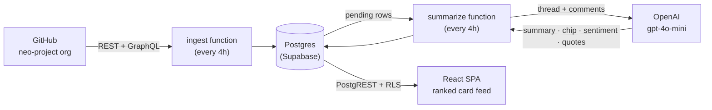
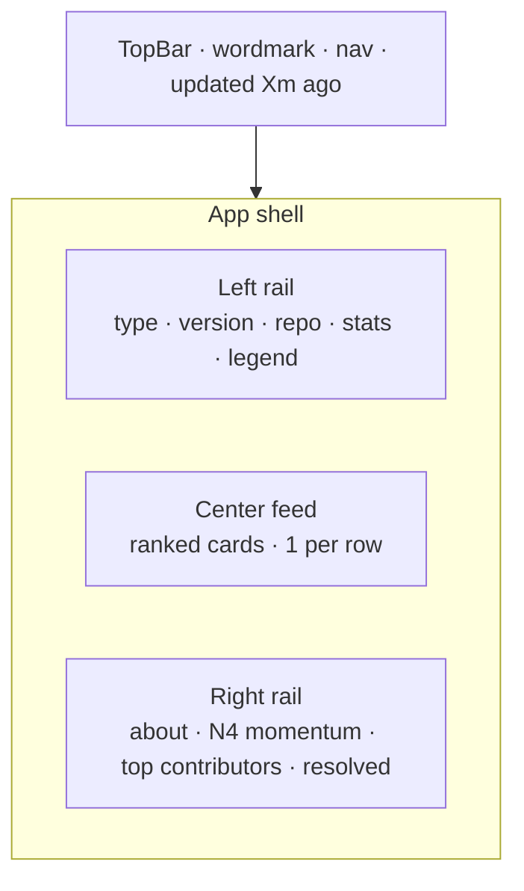
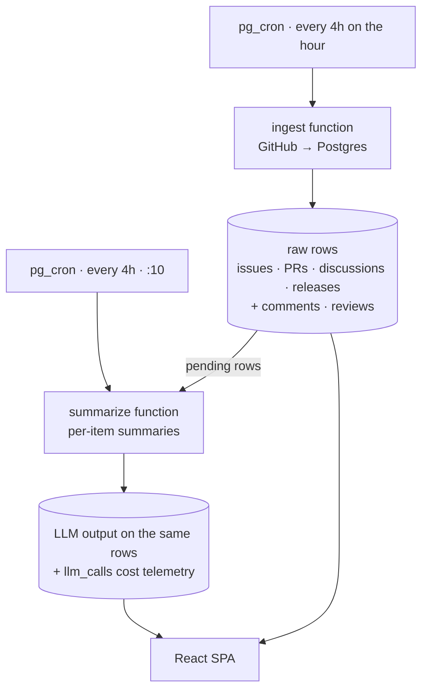

# Gasetta

**Live at [gasetta.com](https://www.gasetta.com)**

> A live, AI-summarised feed of the [`neo-project`](https://github.com/orgs/neo-project/repositories)
> GitHub org — consensus chips, founder markers, and the state of every
> active thread, refreshed every few hours.

Gasetta reads the Neo blockchain's GitHub organisation every four hours
and turns the raw firehose — issues, pull requests, discussions, releases,
commits — into a scannable feed of summaries. Each card carries:

- a one-line AI summary of what the thread is about and where it stands
- a **consensus chip** (Resolved · Decided · Leaning approve · Open · Split · Stalled)
- a **sentiment** indicator (calm · mixed · contentious)
- a **founder marker** when one of Neo's two founders weighed in
- a **version chip** (N3 / N4) when the thread is protocol-tagged

The point: a Neo follower opens the site, scans the feed in 30 seconds,
and knows what's being argued about, what shipped, and where the founders
stand — without ever opening GitHub.



---

## What you get

A vertical feed of cards, filterable by **type** (issues / PRs / discussions /
releases / founder-touched), **version** (N3 / N4 / all), and **repo**.
Sort by Hot (importance), New, or Most discussed.



Each card opens to a **thread page** with the full consensus block: a
multi-sentence summary, the consensus chip, key points, decisions reached
in the thread, and a pulled-out founder quote when applicable.

---

## Architecture in one diagram



Two Edge Functions, one Postgres database, one static SPA. Full detail in
[`ARCHITECTURE.md`](./ARCHITECTURE.md).

---

## Tech stack

- **Database** — Supabase Postgres
- **Compute** — Supabase Edge Functions (Deno/TypeScript)
- **Scheduling** — `pg_cron` + `pg_net`
- **LLM** — OpenAI (`gpt-4o-mini` for per-item summaries; `gpt-4o` for the
  optional org-level digest)
- **Frontend** — Vite + React + TypeScript + React Router + TanStack Query,
  shipped as a static SPA

---

## Local development

### Prerequisites

- Node 20+ and npm
- [Supabase CLI](https://supabase.com/docs/guides/local-development/cli/getting-started)
- Docker (for the local Supabase stack)
- A GitHub fine-grained PAT with **read-only** scopes:
  `metadata:read` · `contents:read` · `pull requests:read` · `issues:read` · `discussions:read`
- An OpenAI API key

### 1. Bring up the local Supabase stack

```sh
cd supabase
supabase start
```

This starts Postgres, PostgREST, Kong, and the Edge Function runtime in
Docker. First run takes a couple of minutes; subsequent runs are fast.

### 2. Apply migrations + seed

```sh
supabase db reset
```

This applies `0001_schema.sql`, `0002_rls.sql`, `0003_summary_gate.sql`,
`0004_cron.sql`, and then runs `seed.sql` (which seeds the two founders).

### 3. Configure secrets for the Edge Functions

```sh
cp supabase/.env.example supabase/.env.local
# Edit supabase/.env.local and fill in:
#   GITHUB_TOKEN=<your fine-grained PAT>
#   OPENAI_API_KEY=<your OpenAI key>
```

### 4. Run the functions

```sh
supabase functions serve --env-file supabase/.env.local
```

In another terminal, kick off an initial ingest + summarize:

```sh
curl -sS -X POST http://127.0.0.1:54321/functions/v1/ingest
# … wait for it to finish (10-30 min on a 30-day bootstrap window) …
curl -sS -X POST http://127.0.0.1:54321/functions/v1/summarize
```

The cron schedules in `0004_cron.sql` will keep the pipeline ticking from
that point on. To make them fire against the locally-served functions
you'll need to set the `gasetta.config` table (see ARCHITECTURE.md §1).

### 5. Run the frontend

```sh
cd apps/web
cp .env.example .env.local
# Fill in VITE_SUPABASE_URL and VITE_SUPABASE_ANON_KEY
# (from `supabase status -o env`)

npm install
npm run dev
```

Open the URL Vite prints. You'll see the live feed populated from your
local database.

---

## Deploying

### Supabase

```sh
supabase link --project-ref YOUR_PROJECT_REF
supabase db push                    # apply migrations to the cloud DB
supabase functions deploy ingest summarize
supabase secrets set --env-file supabase/.env.production
```

Then configure the cron table on the cloud DB:

```sql
insert into gasetta.config (key, value) values
  ('functions_base_url', 'https://YOUR_PROJECT.supabase.co/functions/v1'),
  ('service_role_key',   '<dashboard service-role key>')
on conflict (key) do update set value = excluded.value;
```

### Frontend

The frontend is a static SPA. Build it and deploy the `apps/web/dist/`
directory to any static host (Vercel, Netlify, Cloudflare Pages, GitHub
Pages, etc.):

```sh
cd apps/web
npm run build
```

Set `VITE_SUPABASE_URL` and `VITE_SUPABASE_ANON_KEY` in the host's
environment variable settings.

---

## Repo layout

```
gasetta/
├─ ARCHITECTURE.md    system design + data model
├─ README.md          you are here
├─ LICENSE
├─ CONTRIBUTING.md
├─ supabase/
│  ├─ config.toml
│  ├─ seed.sql
│  ├─ migrations/    SQL migrations
│  └─ functions/     Deno Edge Functions
│     ├─ _shared/    GitHub client, OpenAI client, DB helpers, prompts
│     ├─ ingest/     stage 1: GitHub → Postgres
│     └─ summarize/  stage 2: Postgres → OpenAI → Postgres
└─ apps/
   └─ web/           Vite + React + TypeScript SPA
      └─ src/
         ├─ components/   atoms · FeedCard · LeftRail · RightRail · TopBar
         ├─ pages/        Feed · Thread · Repos · Repo · Founders · Versions · Archive · About
         └─ lib/          supabase client · v3Loader · v3Context
```

---

## Contributing

See [CONTRIBUTING.md](./CONTRIBUTING.md).

Short version: open an issue first for non-trivial changes; commits
follow [Conventional Commits](https://www.conventionalcommits.org/);
no `--no-verify`.

---

## Not affiliated with Neo

Gasetta is an independent, community-built project running at
[gasetta.com](https://www.gasetta.com). It is not affiliated with Neo
Global Development, the Neo Foundation, or any official Neo entity. AI
summaries are best-effort and may contain errors — click through to
GitHub to verify anything material.

---

## License

[MIT](./LICENSE).

---

<p align="center">
  <a href="https://www.gasetta.com"><b>gasetta.com</b></a>
  &nbsp;·&nbsp;
  <a href="https://github.com/smartargs/gasetta">github.com/smartargs/gasetta</a>
  &nbsp;·&nbsp;
  <a href="https://github.com/smartargs/gasetta/issues">issues</a>
  &nbsp;·&nbsp;
  <a href="./LICENSE">MIT</a>
</p>

<p align="center">
  <sub>Built by the community. Not affiliated with Neo or NGD.</sub>
</p>
